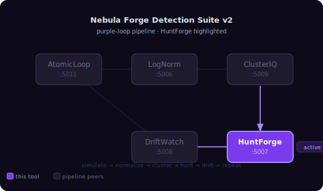
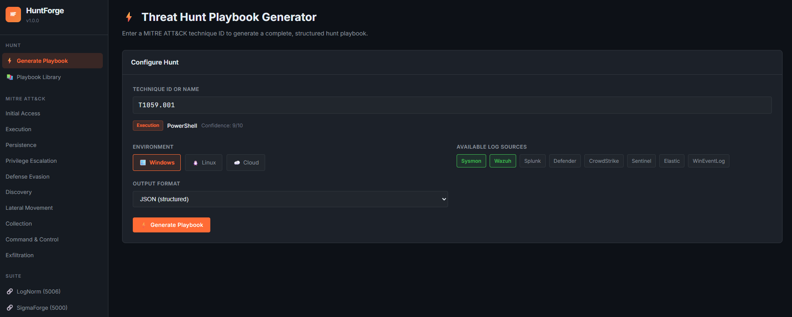

# HuntForge

**Threat Hunt Playbook Generator** — Part of the Nebula Forge suite.

Input a MITRE ATT&CK technique ID → output a complete, analyst-ready hunt playbook with multi-platform detection queries, expected artifacts, and MITRE context. **Fully offline** — no internet connection required.

      

---

## Pipeline Position



> **purple-loop:** `AtomicLoop → LogNorm → ClusterIQ → HuntForge → DriftWatch → repeat`

---

## Screenshots

### Dashboard 




### Playbook Generator


*Enter a technique ID and log sources — playbook generates instantly, fully offline*

### Generated Playbook Detail


*Splunk SPL, Wazuh JSON, Sigma YAML, and KQL queries with artifact and MITRE context panels*

### Playbook Library


*Browse, filter by tactic, search, and export saved playbooks*

---

## Features

- **MITRE ATT&CK coverage** — Embedded dataset covering 60+ techniques across all 10 major tactics (Initial Access, Execution, Persistence, Privilege Escalation, Defense Evasion, Discovery, Lateral Movement, Collection, Command & Control, Exfiltration)
- **Multi-platform queries** — Splunk SPL, Wazuh/Elasticsearch JSON, Sigma YAML, KQL (Microsoft Sentinel) generated per technique
- **Hunt hypothesis** — Narrative hypothesis scoped to your environment and available log sources
- **Artifacts** — Event IDs, log sources, field names, process names, registry keys, command patterns
- **MITRE context** — Sub-techniques, related techniques, detection notes, ATT&CK links
- **Confidence scoring** — 1–10 score adjusted by your available log sources
- **Log source recommendations** — Required/recommended/optional sources with descriptions
- **Playbook library** — Save, browse, filter, and export all generated playbooks
- **Export** — Markdown and JSON export for each playbook
- **LogNorm integration** — `/api/enrich` accepts ECS-lite events and suggests hunt playbooks
- **CLI** — Full command-line interface for pipeline/automation use

---

## Quick Start

```bash
# Install dependencies
pip install -r requirements.txt

# Copy and optionally edit config
cp config.example.yaml config.yaml

# Start the web server
python app.py
```

Open [http://127.0.0.1:5007](http://127.0.0.1:5007)

---

## CLI Usage

```bash
# Generate a playbook (markdown output)
python cli.py --technique T1059.001 --env windows --sources sysmon,wazuh

# Save to file
python cli.py --technique T1059.001 --output playbook.md

# JSON format
python cli.py --technique T1059.001 --format json --output playbook.json

# Search techniques
python cli.py --search powershell
python cli.py --search "lateral movement"

# List all techniques (optionally filtered by tactic)
python cli.py --list
python cli.py --list --tactic Execution

# List all tactics
python cli.py --list-tactics
```

---

## API Reference

### Health

```
GET /api/health
→ {"status": "ok", "tool": "huntforge", "version": "1.0.0"}
```

### Generate Playbook

```
POST /api/playbook/generate
Content-Type: application/json

{
    "technique_id": "T1059.001",
    "context": {
        "environment": "windows",
        "log_sources": ["sysmon", "wazuh", "splunk"]
    },
    "output_format": "json",
    "save": true
}
```

### List Playbooks

```
GET /api/playbooks?page=1&per_page=25&tactic=Execution&search=powershell
```

### Get Playbook

```
GET /api/playbook/<id>
DELETE /api/playbook/<id>
```

### Export Playbook

```
GET /api/playbook/<id>/export?format=json
GET /api/playbook/<id>/export?format=markdown
```

### Technique Search

```
GET /api/techniques?q=powershell
GET /api/techniques?tactic=Execution
GET /api/technique/T1059.001
```

### LogNorm Enrichment

```
POST /api/enrich
Body: {"events": [...ECS-lite events from LogNorm...]}
→ {"suggestions": [...hunt playbook suggestions...]}
```

---

## Playbook Structure

Each generated playbook contains:

| Section | Contents |
|---------|----------|
| **Metadata** | Technique ID, name, tactic, description |
| **Hunt Hypothesis** | Narrative — what the adversary is doing and why |
| **Queries** | Splunk SPL, Wazuh JSON, Sigma YAML, KQL (Sentinel) |
| **Artifacts** | Event IDs, field names, processes, registry keys, network ports |
| **MITRE Context** | Sub-techniques, related techniques, ATT&CK links, detection notes |
| **Log Sources** | Required / recommended / optional with rationale |
| **Confidence** | Score 1–10, coverage %, label, rationale |

---

## MITRE Coverage

| Tactic | Techniques Covered |
|--------|--------------------|
| Initial Access | T1566, T1566.001, T1566.002, T1190, T1133, T1078 |
| Execution | T1059, T1059.001, T1059.003, T1059.005, T1047, T1053.005 |
| Persistence | T1547.001, T1543.003, T1136.001, T1505.003 |
| Privilege Escalation | T1548.002, T1055, T1068 |
| Defense Evasion | T1070.001, T1027, T1562.001, T1036, T1218.011 |
| Credential Access | T1003.001, T1110.003 |
| Discovery | T1082, T1087.001, T1046, T1016, T1057, T1135, T1069.002 |
| Lateral Movement | T1021.001, T1021.002, T1550.002 |
| Collection | T1005, T1056.001, T1560 |
| Command & Control | T1071.001, T1071.004, T1105, T1572 |
| Exfiltration | T1041, T1048, T1567, T1020 |

---

## Nebula Forge Integration

HuntForge runs on port **5007** and integrates with:

- **LogNorm** (5006) — accepts ECS-lite events via `/api/enrich` for context-aware hunt suggestions
- **Nebula Dashboard** (5010) — registers as a tool card

Register in `nebula-dashboard/config.yaml`:

```yaml
tools:
  huntforge:
    label:       "HuntForge"
    url:         "http://127.0.0.1:5007"
    health_path: "/api/health"
    description: "MITRE ATT&CK threat hunt playbook generator"
    category:    "Detection"
```

---

## Project Structure

```
HuntForge/
├── core/
│   ├── engine.py        # Playbook generation engine
│   ├── mitre_data.py    # Embedded MITRE ATT&CK dataset (offline)
│   ├── query_builder.py # Splunk / Wazuh / Sigma / KQL generators
│   └── storage.py       # SQLite persistence layer
├── templates/
│   ├── base.html        # Layout + sidebar
│   ├── index.html       # Generator page
│   ├── playbook.html    # Playbook detail view
│   └── library.html     # Saved playbooks browser
├── static/
│   ├── css/style.css    # Dark theme (Nebula Forge suite)
│   └── js/main.js       # Frontend logic
├── output/              # Exported playbooks
├── app.py               # Flask application
├── cli.py               # Command-line interface
├── requirements.txt
├── config.example.yaml
└── README.md
```

---

## License

This project is licensed under the MIT License — see the [LICENSE](LICENSE) file for details.


<div align="center">

Built by [Rootless-Ghost](https://github.com/Rootless-Ghost) 

Part of the **Nebula Forge** security tools suite.
